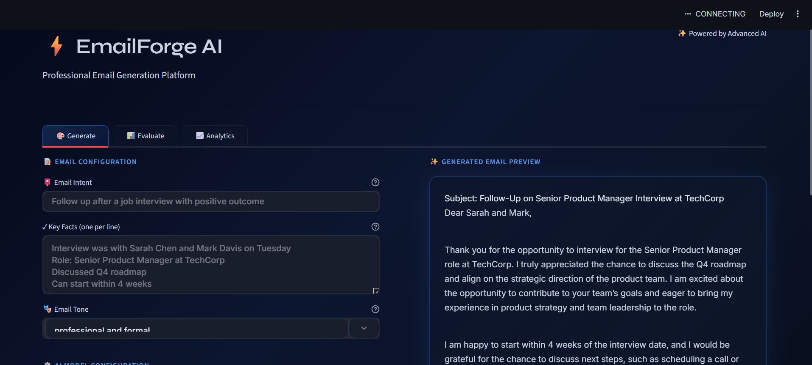

# ⚡ EmailForge AI
## Intelligent Email Generation Powered by AI

<div align="center">


**Transform the way you write professional emails with AI-powered generation and intelligent reasoning**

[🚀 Quick Start](#-quick-start) • [✨ Features](#-features) • [📋 Scenarios](#-10-pre-configured-scenarios) • [🛠️ Setup](#-setup) • [📚 Documentation](#-documentation)

</div>

---

## 🎯 What is EmailForge?

EmailForge is a **next-generation email composition assistant** that leverages advanced AI models to generate contextual, professional, and tonally-appropriate emails in seconds. Whether you're following up after an interview, negotiating with vendors, or announcing a product launch, EmailForge crafts perfect emails tailored to your specific needs.



Perfect for:
- 📧 Professional business communications
- 💼 Sales and partnership outreach  
- 🤝 Customer relationship management
- 📢 Internal team announcements
- 🎓 HR and recruitment functions

---

## ✨ Core Features

<table>
<tr>
<td width="50%">

### 🧠 Dual Generation Strategies

**Strategy A: Direct Generation**
- Fast, straightforward email composition
- Ideal for routine communications
- Instant results for time-sensitive emails

**Strategy B: Chain-of-Thought Reasoning**
- Advanced multi-step reasoning process
- Dr. Elena Vasquez protocol for depth
- Superior contextual understanding
- Perfect for complex, high-stakes emails

</td>
<td width="50%">

### 🎨 Tone Customization

Choose from **9 sophisticated tones** to match any scenario:

- 🎩 Professional & Formal
- 😊 Warm & Friendly
- 💙 Empathetic & Supportive
- 💪 Confident & Assertive
- 💬 Casual & Conversational
- 🔥 Enthusiastic & Energetic
- 😔 Apologetic & Conciliatory
- ⚠️ Urgent & Direct
- 📊 Data-Driven & Analytical

</td>
</tr>
</table>

<table>
<tr>
<td width="50%">

### 📚 Pre-Configured Scenarios

**10 expertly-crafted templates** covering:

1. Post-Interview Follow-ups
2. Deadline Extension Requests
3. Client Proposal Follow-ups
4. Team Offsite Announcements
5. Customer Complaint Resolution
6. Partnership Proposals
7. Product Launch Announcements
8. Reference Letter Requests
9. Vendor Price Negotiations
10. Employee Recognition

</td>
<td width="50%">

### 🎨 Modern UI/UX Design

- **Glassmorphic Interface** with blur effects
- **Dark Mode** optimized for focus
- **Smooth Animations** for enhanced interactivity
- **Responsive Design** works on all devices
- **Real-time Feedback** with loading states
- **Professional Typography** using Inter & Syne fonts

</td>
</tr>
</table>

---

## 🚀 Quick Start

### Prerequisites
- Python 3.8 or higher
- Either Ollama (free, local) or OpenAI API key

### Option 1: Using Ollama (Recommended - Free & Local)

```bash
# 1️⃣ Install Ollama
# Download from: https://ollama.ai

# 2️⃣ Start Ollama Service
ollama serve

# 3️⃣ In a new terminal, clone and setup the project
git clone https://github.com/yourusername/email-forge.git
cd email-forge

# 4️⃣ Create virtual environment
python -m venv venv
source venv/bin/activate  # On Windows: venv\Scripts\activate

# 5️⃣ Install dependencies
pip install -r requirements.txt

# 6️⃣ Pull Llama3 model (one-time, ~4.7GB)
ollama pull llama3

# 7️⃣ Run the app
streamlit run app.py
```

### Option 2: Using OpenAI API

```bash
# 1️⃣ Clone and setup
git clone https://github.com/yourusername/email-forge.git
cd email-forge

# 2️⃣ Install dependencies
pip install -r requirements.txt

# 3️⃣ Create .env file
echo "OPENAI_API_KEY=your-api-key-here" > .env
echo "OLLAMA_URL=http://localhost:11434" >> .env

# 4️⃣ Run the app
streamlit run app.py
```

---

## 📋 10 Pre-Configured Scenarios

<table>
<tr>
<td width="25%">

#### 1️⃣ Post-Interview Follow-up
**Tone:** Professional & Grateful
- Reinforce key discussion points
- Express enthusiasm
- Include timeline info
- Reference interviewers by name

</td>
<td width="25%">

#### 2️⃣ Deadline Extension Request
**Tone:** Professional & Apologetic
- Explain delay causes
- Reassure quality won't suffer
- Offer progress updates
- Provide clear new timeline

</td>
<td width="25%">

#### 3️⃣ Client Proposal Follow-up
**Tone:** Confident & Gently Urgent
- Reference specific terms
- Reiterate key benefits
- Offer flexible next steps
- Create sense of momentum

</td>
<td width="25%">

#### 4️⃣ Team Offsite Announcement
**Tone:** Enthusiastic & Inclusive
- Build excitement through details
- Cover logistics clearly
- Request RSVP with deadline
- Emphasize team connection

</td>
</tr>
<tr>
<td width="25%">

#### 5️⃣ Customer Complaint Resolution
**Tone:** Empathetic & Reassuring
- Acknowledge frustration genuinely
- Take responsibility
- Offer tangible compensation
- Provide resolution timeline

</td>
<td width="25%">

#### 6️⃣ Partnership Proposal
**Tone:** Formal & Value-Focused
- Lead with mutual benefits
- Support claims with data
- Show compatibility
- Call to action

</td>
<td width="25%">

#### 7️⃣ Product Launch Announcement
**Tone:** Enthusiastic & Customer-Focused
- Highlight key features
- Show customer benefits
- Create urgency with incentives
- Easy access to trial/purchase

</td>
<td width="25%">

#### 8️⃣ Reference Letter Request
**Tone:** Polite & Appreciative
- Be specific about role context
- Reference shared achievements
- Respect their time
- Offer assistance

</td>
</tr>
<tr>
<td width="25%">

#### 9️⃣ Vendor Price Negotiation
**Tone:** Assertive & Data-Driven
- Reference competitive benchmarks
- Show long-term commitment value
- Propose multiple options
- Professional but firm

</td>
<td width="25%">

#### 🔟 Employee Recognition
**Tone:** Warm & Sincere
- Be specific about achievements
- Quantify impact
- Show genuine appreciation
- Mention recognition/rewards

</td>
<td width="50%"></td>
</tr>
</table>

---

## 🛠️ Setup & Configuration

### Environment Variables

Create a `.env` file in the project root:

```env
# Ollama Configuration
OLLAMA_URL=http://localhost:11434

# OpenAI Configuration (Optional)
OPENAI_API_KEY=your-api-key-here
```

### Custom Model Selection

Edit `api.py` to change the AI model:

```python
MODEL = "qwen3:4b"  # Current: Qwen with 4B parameters
# Other options: "llama3", "mistral", "neural-chat", "orca", etc.
```

Then pull the model:
```bash
ollama pull <model-name>
```

---

## 📊 Architecture & Tech Stack

### Frontend
- **Streamlit** - Rapid web application framework
- **Custom CSS** - Glassmorphic design system
- **Font Stack** - Inter (UI), Syne (Headlines)

### Backend
- **Python 3.8+** - Core language
- **Requests** - HTTP client for Ollama/OpenAI
- **Python-dotenv** - Environment management
- **OpenAI SDK** - OpenAI API integration

### AI & LLMs
- **Ollama** - Local LLM runtime (Llama3, Mistral, Qwen, etc.)
- **OpenAI GPT-3.5** - Cloud-based option
- **Dual-Strategy Architecture** - Simple + Chain-of-Thought

### Project Structure
```
email-forge/
├── app.py                 # Streamlit main application
├── api.py                 # AI generation & prompt building
├── scenarios.py           # 10 pre-configured scenarios
├── requirements.txt       # Python dependencies
├── .env                   # Configuration (create this)
├── SETUP.md              # Setup documentation
└── README.md             # This file
```

---

## 🎮 How to Use

### Step 1: Launch the App
```bash
streamlit run app.py
```
The app opens at `http://localhost:8501`

### Step 2: Select Your Scenario
- Choose from 10 pre-configured scenarios, OR
- Create a custom email with your own intent/facts

### Step 3: Customize Tone
- Select from 9 professional tones
- Match your communication style

### Step 4: Choose Generation Strategy
- **Strategy A**: Fast, direct generation
- **Strategy B**: Thoughtful, multi-step reasoning

### Step 5: Generate & Refine
- Click "Generate Email"
- Review the generated content
- Copy to clipboard or download
- Refine as needed

---

## 🔧 Troubleshooting

| Issue | Solution |
|-------|----------|
| **"Cannot connect to Ollama"** | Ensure `ollama serve` is running in a terminal |
| **"Model not found"** | Run `ollama pull <model-name>` (e.g., `ollama pull llama3`) |
| **Slow responses** | First request loads model into memory (normal behavior) |
| **Out of memory error** | Reduce model size:  Use "qwen3:2b" or reduce Ollama RAM allocation |
| **OpenAI API errors** | Verify your API key, check quota, ensure network connectivity |
| **Port 8501 already in use** | Run on different port: `streamlit run app.py --server.port 8502` |

---

## 🚀 Advanced Features

### Custom Scenario Builder
Add your own email scenarios to `scenarios.py`:

```python
{
    "id": 11,
    "label": "Your Scenario Name",
    "intent": "What you want to accomplish",
    "facts": ["fact1", "fact2", "fact3", "fact4"],
    "tone": "tone from the list",
    "referenceEmail": "Example output (optional)"
}
```

### Batch Generation
Generate multiple emails with different tones:

```python
from scenarios import SCENARIOS
from api import generate_email

scenario = SCENARIOS[0]
for tone in ["professional", "casual", "enthusiastic"]:
    email = generate_email(
        intent=scenario["intent"],
        facts=scenario["facts"],
        tone=tone,
        strategy="B"
    )
    print(f"Tone: {tone}\n{email}\n---\n")
```

### API Integration
Use EmailForge in your own applications:

```python
from api import generate_email

email = generate_email(
    intent="Follow up on proposal",
    facts=["Sent proposal last week", "No response yet", "Willing to discuss terms"],
    tone="confident and professional",
    strategy="B",
    openai_api_key="sk-..."  # Optional
)
print(email)
```

---

## 📊 Performance Metrics

| Aspect | Details |
|--------|---------|
| **Ollama Model Size** | 4B parameters (Qwen) = ~2.5GB RAM |
| **Average Response Time** | 2-5 seconds (subsequent requests) |
| **First Load Time** | 10-20 seconds (model initialization) |
| **UI Responsiveness** | <100ms (glassmorphic animations) |
| **Supported Tones** | 9 distinct communication styles |
| **Pre-configured Scenarios** | 10 professional templates |

---

## 🤝 Contributing

We welcome contributions! Here's how to get started:

1. **Fork** the repository
2. **Create** a feature branch (`git checkout -b feature/AmazingFeature`)
3. **Commit** your changes (`git commit -m 'Add some AmazingFeature'`)
4. **Push** to the branch (`git push origin feature/AmazingFeature`)
5. **Open** a Pull Request

### Areas for Contribution
- 🎨 Additional email scenarios
- 🌍 Multi-language support
- 📈 Performance optimizations
- 🧪 Unit tests and integration tests
- 📚 Documentation improvements
- 🐛 Bug fixes and improvements

---

## 📝 License

This project is licensed under the **MIT License** - see the LICENSE file for details.

---

## 💡 Key Highlights

<div align="center">

| Feature | Benefit |
|---------|---------|
| 🆓 **Free & Open Source** | No licensing costs, full transparency |
| 🏠 **Local-First Option** | Keep data private with Ollama |
| ⚡ **Lightning Fast** | Generate emails in seconds |
| 🎯 **Purpose-Built** | Optimized for professional communications |
| 🧠 **AI-Powered** | Advanced reasoning with Chain-of-Thought |
| 🎨 **Beautiful UI** | Modern glassmorphic design |
| 📱 **Responsive** | Works on desktop and mobile |
| 🔧 **Customizable** | Extend with your own scenarios |

</div>

---

## 📞 Support & Feedback

- 🐛 **Report Bugs**: [GitHub Issues](https://github.com/yourusername/email-forge/issues)
- 💬 **Discussions**: [GitHub Discussions](https://github.com/yourusername/email-forge/discussions)
- 📧 **Email**: support@emailforge.dev
- 🐦 **Twitter**: [@EmailForgeAI](https://twitter.com/emailforge)

---

## 🙏 Acknowledgments

- **Ollama** for enabling local LLM inference
- **Streamlit** for the amazing web framework
- **OpenAI** for GPT-3.5 integration
- **Community Contributors** for feedback and improvements

---

<div align="center">

### 🌟 Star us on GitHub if you find EmailForge helpful!

**Built with ❤️ for better business communication**

[⬆ Back to top](#-emailforge-ai)

</div>
